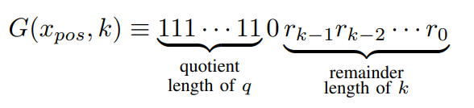
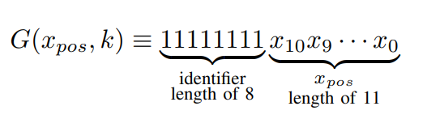

# Masters_PC_SW
Software for lossless Bayer CFA Image compression and decompression on PC using C++ and Python.

# How to:
1. put your colour png images into a folder "original" inside "dataset" folder inside "images" folder. The name convention for the image files is: "img_xx.png" where "xx" is index.
2. run GUI_2_png.py
* choose "dataset" folder as the source. The GUI will search for "original" folder.
* if your images are alrady in Bayer GB format, then tick appropriate tick box
* enter start and end indices
* choose colour resolution. Recommended to leave it at 8 BPP.
* press submit.
* your images will be converted to bayer GB format and saved as uncompressed binary file to the folder "BayerCFA_GB".

# How to generate bayerCFA .bin file from .png files:
1. For a new dataset, in `images` create new folder named `dataset`. 
2. Then create another new folder in `dataset` called `original`. Put your png images in it. The images should be named `img_ii.png` where `ii` is image index. Or create/adjust custom file reading script (e.g. `driveNscan/png2bayerCFA_GB_drivenscan.py`)
3. Then launch command prompt and navigate to `images` folder and run `python png2bayerCFA_GB.py -i "optomotive" -o "optomotive" -s 0 -e 15`. Run `python png2bayerCFA_GB.py -h` for help.

# How to compress images using cpp compressor
Cpp compressor can be used to compress .bin image files to another .bin file. Evenmore, if `DUMP_VERIFICATION` is defined in `globalDefines.hpp` when compiling `main.cpp`, compressor will dump the following files which can be used as test vectors in VHDL testbench.

Test files generated in `output_folder/dump`:
- _16pp.txt: file with 16 parallel pixels in single line
- _BAYER.txt: file with bayer pixels. Each line contains one bayer quadruple (gr,r,b,gb)
- _calc.txt: file with data from k calculation process
- _dpcm.txt: file with DPCM data. Each row contains YCCC and DPCM data in HEX.
- _qr.txt: file with positive val, quotient, remainder.
- _qrK.txt: file with quotient, remainder & k

And finally:
- _bitstream.txt: ASCII representation of compressed image bitstream. (binary image is in ../compressed )

Data file name:
`img_ii_l_uuuu_contents.filetype` where 
- `ii` is image index
- `l` is number of lossy bits used in compression
- `u` is maximal length of unary code
- `contents` tells what is in the file
- `filetype` tells if file can be opened in text editor (`.bin` cannot be)

e.g. `img_05_01_0008_qrK.txt` is qrK file for img_05.png with 1 lossy bit and unary length limitation 8

To compress, run `python run_compression.py -c "../CPP_encoder_decoder/main.exe" -i "KODAK_dataset" -o "KODAK_dataset" -s 1 -e 3 -l 0 -u 8`

### Golomb Rice coding

Code is constructed from unary part, delimiter '0' bit and remainder of length k:

### Maximal length of unary code
If quotient value in Golomb Rice coding exceeds or is equal to `u` (by default 8), then the code is constructed from identifier and 11 bit value coded in two's complement. Identifier consists of `u` sequental '1's and is followed by 11 bit encoding x_pos value (no GR encoding in this case). Then code length is then limited to `u + 11` (19) bits. There is no delimiter '0' in limited encoding. For a decoder "11111111" serves as a keyword to not use GR deocder but instead to read next 11 bits as a two's complement number.

# How to decompress images using cpp decompressor
`python run_decompression.py -c "../CPP_encoder_decoder" -i "KODAK_dataset" -o "KODAK_dataset" -s 1 -e 3 -l 0 -u 8 -p 16 -x 384 -y 256`

# How to generate test files for FPGA code testing:
Open cmd in `SW_PC\images` and run 

~~`python generate_verification_files.py -c "../CPP_encoder_decoder/main.exe" -i "edge_cases" -o "edge_cases" -s 32 -e 33 -l 0 -k 0 -p 16`~~ 

`python run_compression_decompression.py -c "../CPP_encoder_decoder" -i "KODAK_dataset" -o "KODAK_dataset" -s 1 -e 3 -l 0 -u 8`

`run_compression_decompression.py` parameters: 
- -v : Verbose (default False).
- -c : CompressorExecutable (required, default None).
- -i : Input location (required, default None).
- -o : Output location name (required, default None).
- -s : Start index for img range (required, default 0).
- -e : End index for image range (required, default 0).
- -l : Lossy compression. Specify in bits that will be cut. (default 0).
- -u : Unary length when decompressor switches to binary coding of positive value (2041 for no limitation. 8 recommended).

Then go to `saxis_omls_compression_tb.vhd` and edit `C_IN_BAYER_0` and `C_OUT_BITSTREAM_O_0`constants.

# Software CPP_encoder_decoder

## OpenCL support

Download necessary SDK for OpenCL development on your PC. For Windows PC with Intel i7 with Iris Xe, that is Intel's OneAPI software bundle. Install and download. If you have AMD or NVIDIA GPU, Google for "RTX8000 OpenCl SDK" or whateher the name of you GPU is.

### Visual Studio Code
In your development environment (`c_cpp_properties.json`) add folder `"C:/Program Files (x86)/Intel/oneAPI/2024.2/include/sycl"` to your `includePath` so that IDE recognises functions. Set up compiler by adding `"-I", "C:\\Program Files (x86)\\Intel\\oneAPI\\2024.2\\include\\sycl"` to `args` in `tasks.json` to compile necessarry OpenCL files. Add flags `"-L", "C:\\Program Files (x86)\\Intel\\oneAPI\\2024.2\\lib"` and `"-lOpenCL"` to `args` in `tasks.json` so that also linker will find required files. Add define `"-D INCLUDE_OPENCL"` to args in `tasks.json` to compile OPENCL implementation of decompression.

### Visual Studio

* Properties -> C/C++ -> All Options -> Additional Include Directories: `"C:\Program Files (x86)\Intel\oneAPI\2024.2\include\sycl"`
* Properties -> Linker -> General -> Additional Library Dependencies: `"C:\Program Files (x86)\Intel\oneAPI\2024.2\include\sycl"`
* Properties -> Linker -> Input -> Additional Dependencies: `"C:\Program Files (x86)\Intel\oneAPI\2024.2\lib\OpenCL.lib"`

Function `identify_platforms()` in `opencl_platforms.cpp` can be used to check OpenCl compatibility and available devices on the system. 